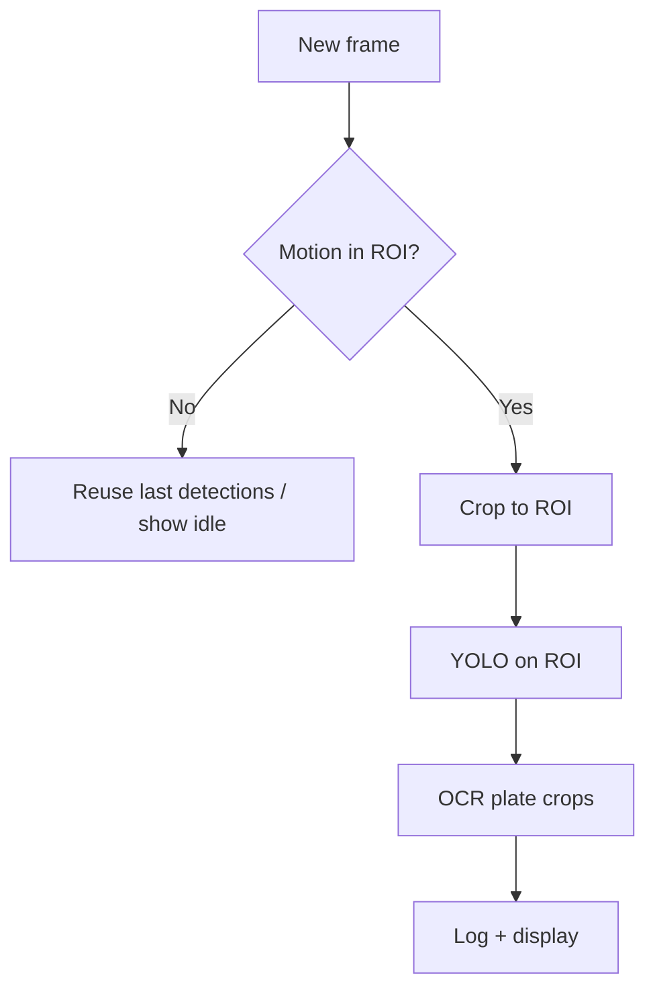

# ROI and Motion Gating — Explained for This Project

Right now, every processed frame runs **YOLO on the entire image**, then **EasyOCR on every plate box** YOLO finds:

```python
def process_frame(
    frame,
    yolo: YOLO,
    reader: easyocr.Reader,
    ...
) -> list[tuple[tuple[int, int, int, int], str]]:
    """Detect plates, OCR crops, return list of (box, text)."""
    h, w = frame.shape[:2]
    results = yolo.predict(frame, conf=conf, verbose=False)
```

That works, but on a **fixed camera** (parking gate, driveway, toll lane) most of the frame is useless: sky, walls, trees, parked cars that never move. ROI and motion gating are two ways to **avoid wasting work on parts of the frame where plates won't appear**.

---

## ROI (Region of Interest)

**Idea:** Only run detection inside a predefined rectangle (or polygon) of the frame.

### Why it helps

For a gate camera pointed at the road:

```
┌─────────────────────────────┐
│  sky, building, trees       │  ← YOLO often finds false "plates" here
│                             │     (signs, grilles, reflections)
├─────────────────────────────┤
│                             │
│   ROI: road / lane area     │  ← plates almost always here
│                             │
└─────────────────────────────┘
```

Benefits:

- **Fewer false positives** — signs and bumper patterns outside the lane are ignored
- **Faster** — YOLO sees fewer pixels (you crop before `predict`, or filter boxes after)
- **More stable OCR** — less random text from background objects

### How it would fit your code

Conceptually, before `yolo.predict`:

```python
# Example: bottom 50% of frame only
roi = frame[h//2:h, 0:w]
results = yolo.predict(roi, conf=conf, verbose=False)
# Then shift box coordinates back: y1 += h//2, y2 += h//2
```

Or after detection: drop any box whose center falls outside the ROI.

### When ROI works well

- Camera is **mounted and never moves** (CCTV, gate cam)
- Cars always pass through the **same lane/area**
- You can draw the ROI once during setup

### When ROI is a bad idea

- Handheld phone / moving webcam
- Pan-tilt cameras
- Plates can appear anywhere (wide parking lot overview)

---

## Motion gating

**Idea:** Don't run YOLO (or OCR) until something **moves** in the frame.

### Why it helps

On an empty driveway, your current loop still runs YOLO every N frames (`--skip-frames`). Motion gating says:

> "If nothing changed since last frame, skip detection entirely and reuse old results (or show nothing)."

```
Frame 1-100:  empty driveway     → no motion → skip YOLO
Frame 101:    car enters          → motion!  → run YOLO + OCR
Frame 102-130: car moving         → motion   → keep detecting
Frame 131+:   car gone, static    → no motion → skip again
```

Benefits:

- **Much lower CPU/GPU use** when idle (important on CPU-only setups)
- **Less log noise** — fewer phantom reads from static background
- Complements `--skip-frames`: skip-frames reduces frequency; motion gating can reduce it to **zero** when idle

### Simple implementation (frame differencing)

```python
gray = cv2.cvtColor(frame, cv2.COLOR_BGR2GRAY)
gray = cv2.GaussianBlur(gray, (21, 21), 0)

if prev_gray is not None:
    diff = cv2.absdiff(prev_gray, gray)
    _, thresh = cv2.threshold(diff, 25, 255, cv2.THRESH_BINARY)
    motion_pixels = cv2.countNonZero(thresh)
    if motion_pixels < MIN_MOTION:  # e.g. 5000 pixels
        return last_detections  # skip YOLO entirely

prev_gray = gray
# ... run YOLO as normal
```

You can apply motion detection **only inside the ROI** for even better results.

### When motion gating works well

- Fixed camera, cars are the main moving objects
- Long idle periods (night, empty lot)
- You care about **throughput / power**, not every single frame

### Pitfalls

- **Wind in trees**, shadows, flickering lights → false motion
- **Slow creep** (car rolling very slowly) → might miss if threshold is too high
- **First frame** after idle needs a warm-up (one detection pass)

Mitigations: ROI + higher motion threshold, or background subtraction (`cv2.createBackgroundSubtractorMOG2`) instead of simple diff.

---

## ROI vs motion gating — comparison

| | ROI | Motion gating |
|---|-----|----------------|
| **What it limits** | *Where* in the frame | *When* to run detection |
| **Setup** | Draw zone once (manual or config) | Threshold tuning |
| **Saves work when** | Plates only in one area | Scene is static |
| **False positive source** | Wrong ROI cuts off real plates | Trees, shadows trigger motion |
| **Best for** | Gate, lane, driveway cam | 24/7 stream with idle time |

They stack well: **motion in ROI → then YOLO in ROI**.



---

## Compared to what you already have

You already have **`--skip-frames`**, which runs YOLO every 2nd, 3rd, etc. frame **regardless of content**:

| Mechanism | Idle driveway | Car passing |
|-----------|---------------|-------------|
| `--skip-frames 2` | YOLO every 3rd frame | YOLO every 3rd frame |
| Motion gating | YOLO **never** (until motion) | YOLO every frame (or every N) |
| ROI | YOLO on half the image | YOLO on half the image |

So motion gating is the bigger win for **idle** scenes; ROI is the bigger win for **false positives** and slightly smaller inputs.

---

## Practical example for your use case

**Scenario:** USB webcam aimed at a driveway, car drives in and out.

1. **ROI:** `--roi 0.0,0.4,1.0,1.0` → use bottom 60% of frame (y from 40% to 100%)
2. **Motion:** only call `process_frame` when > 8000 pixels change in that ROI
3. **Keep** `--skip-frames 1` while car is moving if CPU still struggles

Expected effect on CPU:

- Without optimizations: YOLO + OCR on full 1280×720 every other frame
- With ROI + motion: YOLO on ~1280×432 only when a car appears

---

## What to add to the project (if you implement later)

Minimal CLI flags:

```bash
python alpr_system.py --source 0 --roi 0,0.4,1,1 --motion-threshold 8000
```

- `--roi x1,y1,x2,y2` — normalized 0–1 coordinates
- `--motion-threshold N` — pixel change count; `0` = disable motion gating
- Optional: `--draw-roi` to show the green rectangle during setup

For setup, a one-time "click two corners to define ROI" mode is nicer than guessing numbers.

---

## Bottom line

ROI answers *"where should I look?"* Motion gating answers *"is there anything worth looking at?"* The current code does neither — it always scans the full frame — which is fine for demos and handheld testing, but wasteful and noisier for a fixed gate-style camera.
